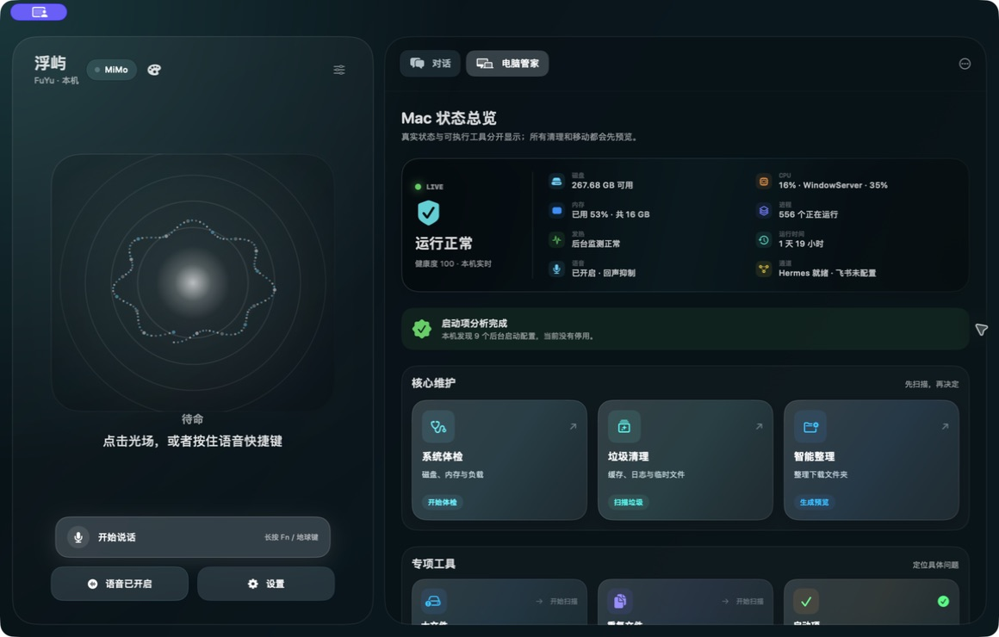

<div align="center">
  
  <h1>浮屿 FuYu</h1>
  <p><strong>会听、会说、会照看 Mac 的原生桌面助手</strong></p>
  <p>语音对话、电脑管家、跨应用执行与飞书远程沟通，集中在一个有反馈、可确认的 macOS 界面里。</p>

  <p>
    
    
    
    
  </p>

  <p>
    <a href="https://github.com/huochao123/FuYu/releases">下载最新版</a>
    · <a href="#核心能力">核心能力</a>
    · <a href="#安装">安装</a>
    · <a href="CHANGELOG.md">更新日志</a>
    · <a href="PRIVACY.md">隐私说明</a>
    · <a href="#english">English</a>
  </p>
</div>



## 不只是一个聊天窗口

浮屿是一款面向 Apple Silicon Mac 的原生助手。它可以停留在刘海下方，通过语音、快捷键、文字或飞书接收要求；简单的电脑维护由本机直接完成，复杂的跨应用任务再交给 Hermes 规划和验证。

| 语音助手 | 本机电脑管家 | 远程与自动化 |
| --- | --- | --- |
| 声音联动光场、实时字幕、自然播报 | 系统体检、垃圾扫描、文件整理 | 飞书 WebSocket 远程对话 |
| 长按 Fn / 地球键、Siri、菜单栏唤醒 | 大文件、重复文件、启动项、应用残留 | Hermes 处理复杂跨应用任务 |
| 可随时关闭识别，双击悬浮入口停止误识别 | 持续高负载与发热进程判断 | 修改 Mac 前保留本机确认 |

## 核心能力

### 一个真正可用的主界面

- 左侧是声音联动光场、语音状态和直接控制区；右侧承载对话与电脑管家。
- 三套主界面主题：深海蓝青、暖金石墨、冰川银蓝。
- 采用分层磨砂玻璃与 Liquid Glass 风格，并为旧系统提供原生材质回退。
- 功能卡片支持整卡点击、鼠标悬停高亮、按下缩放、执行动画和完成状态，不让操作“悄悄发生”。
- 状态屏完整展示每次扫描的数量与逐条明细；内容较多时在屏幕内部滚动，不必前往聊天记录。

### 不绕模型的本机电脑管家

九项基础工具直接读取本机状态，不消耗模型额度，也不经过 Hermes：

- 系统体检
- 垃圾清理预览
- 下载文件夹智能整理预览
- 大文件扫描
- 重复文件哈希确认
- 启动项检查
- 发热进程持续负载判断
- 应用残留扫描
- 性能与存储优化建议

所有涉及清理和移动的操作都遵循 **先扫描 → 看预览 → 明确确认 → 移到废纸篓**。浮屿不会因为点了一张卡片就直接删除文件。

### 更安静、更可控的语音

- 支持 Apple 本地识别、自动识别和 MiMo 混合校正。
- 启用 Apple Voice Processing，降低电脑视频和浮屿自身播报造成的回声误识别。
- 主界面可直接关闭语音识别；识别中关闭会立即停止且不发送。
- 悬浮入口双击可结束当前识别，不提交误触内容。
- 支持打断播报、暂停任务和追加修改要求。

### 飞书远程入口

通过独立的飞书企业自建应用和 WebSocket 长连接，可以在外面直接与浮屿对话，不需要额外部署公网服务器。聊天回复可直接返回；清理、移动文件和系统修改仍会在 Mac 上等待确认。

### 多模型、记忆与人格

- 支持 MiMo、OpenAI、Claude、Gemini、DeepSeek、通义千问、Kimi、智谱 GLM、Ollama / LM Studio 与自定义兼容接口。
- 最近对话与永久习惯分层保存；只有明确要求“记住”的内容才进入永久习惯。
- 支持自定义人格、关系、背景和说话方式。
- 可预览并导入 SillyTavern Character Card V1/V2、常见 PNG 角色卡和提示词预设。

## 同一套视觉语言

主界面和设置中心使用一致的深海背景、玻璃卡片、圆角、间距与按压反馈。设置不再像另一个独立工具。


浮屿还提供六款悬浮入口皮肤，可在设置中即时切换：

| 粒子声场 | 极光流体 | 经典圆球 |
| --- | --- | --- |
|  |  |  |

## 安全与隐私

- 不包含广告或遥测。
- 不保存原始录音。
- 模型密钥、偏好和本地记忆不会写入源码仓库。
- 电脑管家扫描在本机完成；Hermes 只用于复杂跨应用任务。
- Hermes 是可选依赖。没有 Hermes 时，聊天、语音、记忆与电脑管家仍可使用。
- 云端模型、云端 TTS 或混合 ASR 只会把完成相应功能所需的数据发送给用户选择的服务商。

详见 [隐私说明](PRIVACY.md) 与 [安全说明](SECURITY.md)。

## 系统要求

- macOS 15 或更高版本
- Apple Silicon Mac
- 使用语音时需要麦克风和语音识别权限
- 复杂跨应用控制需要辅助功能权限与 Hermes 环境
- 云端模型或语音服务需要用户自己的 API 密钥

## 安装

1. 前往 [Releases](https://github.com/huochao123/FuYu/releases) 下载最新 DMG。
2. 将“浮屿”拖入“应用程序”。
3. 首次启动时，只允许实际需要的权限。
4. 在设置中选择模型、语音与识别方式。

当前公开构建使用临时签名。正式大范围分发前仍建议使用 Apple Developer ID 签名并完成公证。

## Siri 唤醒

在“快捷指令”中新建名为“开始说话”的快捷指令，添加“打开 URL”，填入：

```text
fuyu://listen
```

之后说“嘿 Siri，开始说话”即可唤醒浮屿。

## 从源码构建

```sh
DEVELOPER_DIR=/Library/Developer/CommandLineTools swift build
.build/debug/MiMoMac --self-test
scripts/package-app.sh
scripts/create-installer.sh
```

## 开源组件与参考

- 安全缓存扫描、白名单路径校验、移到废纸篓和本机清理日志集成 [Dusty CleanerEngine](https://github.com/yagcioglutoprak/dusty)（MIT），许可见 [THIRD_PARTY_NOTICES.md](THIRD_PARTY_NOTICES.md)。
- 实时状态屏与后台采样的功能设计参考 [Stats](https://github.com/exelban/stats)；浮屿使用自己的轻量采样与连续高负载判断。
- [Mole](https://github.com/tw93/mole) 仅作为产品与安全边界参考，没有合并其 GPLv3 代码。

欢迎提交 Issue、交互建议与代码改进。参与前请阅读 [CONTRIBUTING.md](CONTRIBUTING.md)。

---

## English

**FuYu is a native voice assistant and local Mac care console for Apple Silicon.** It combines a sound-reactive voice interface, shared conversation, local maintenance tools, Feishu remote messaging, and optional Hermes-powered cross-app actions in one feedback-rich macOS experience.

### Highlights

- Native SwiftUI + AppKit experience with glass materials and three main-window themes.
- Local Mac Care: health inspection, safe junk preview, Downloads organization preview, large files, duplicates, login items, hot processes, leftovers, and optimization advice.
- Full-card hit targets with hover, press, running, completion, and failure feedback.
- Voice master switch, echo suppression, interruption, Fn/Globe push-to-talk, Siri Shortcut URL, and double-click cancellation.
- Feishu WebSocket channel for remote conversation with local approval retained for Mac changes.
- MiMo, OpenAI, Claude, Gemini, DeepSeek, Qwen, Kimi, GLM, Ollama / LM Studio, and custom compatible providers.
- Layered local memory, custom personas, and SillyTavern character/preset import.
- No telemetry or ads. Hermes is optional and reserved for complex cross-app actions.

### Requirements and install

Requires macOS 15+ on Apple Silicon. Download the latest DMG from [Releases](https://github.com/huochao123/FuYu/releases), drag FuYu into Applications, and grant only the permissions required by the features you use.

See [PRIVACY.md](PRIVACY.md), [SECURITY.md](SECURITY.md), [CHANGELOG.md](CHANGELOG.md), and [ROADMAP.md](ROADMAP.md).

---

FuYu is an independent open-source project and is not affiliated with Apple or any listed model provider. Released under the [MIT License](LICENSE).
