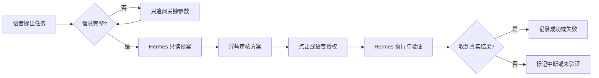
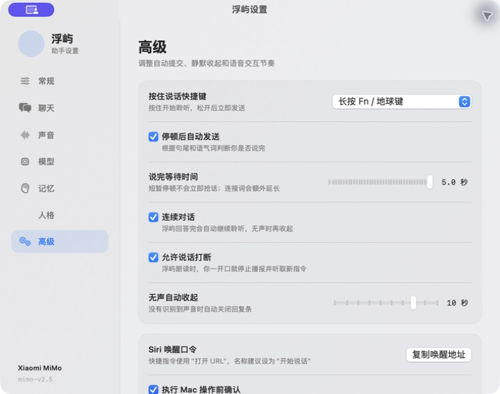
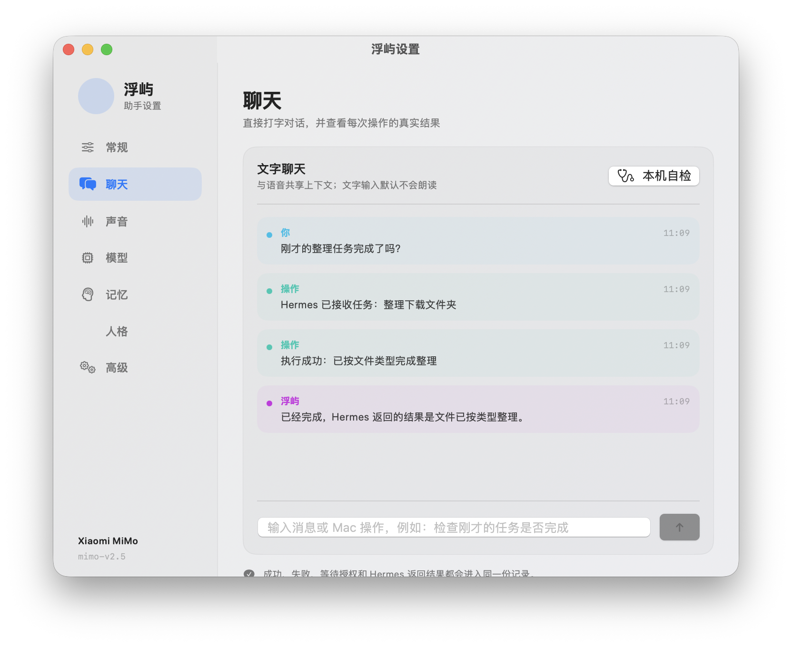

# 浮屿 FuYu

**一款停留在刘海下方、能听懂你并操作 Mac 的原生语音助手。**  
**A native voice assistant that lives below the Mac notch, talks naturally, and can help operate your Mac.**


[中文](#中文介绍) · [English](#english)


## 中文介绍

浮屿是为 macOS 设计的轻量语音助手。它在空闲时完全隐藏，通过 Siri、全局快捷键或菜单栏唤醒；聆听、思考和回答时，以粒子动画和紧凑气泡显示当前状态。除了聊天，它还能把自然语言指令交给 Hermes / CUA，在用户可控的确认机制下操作 Mac。


### 一次完整任务演示 / One complete task walkthrough

下面展示的是当前版本真实具备的流程。示例中的界面均来自实际运行版本；为了避免产生无用会议，文档只演示交互链路，不在录制时真正创建会议。

> **你：**“下午 3 点到 4 点，用腾讯会议创建一次测试会议。”
> **浮屿：**识别这是 Mac 操作，补齐目标与完成标准；复杂任务先向 Hermes 获取只读方案并审核。
> **授权：**紧凑气泡显示时间、会议类型和执行方式。你可以点击“允许”，也可以直接说“允许执行”。
> **执行：**Hermes 接收任务、调用相应工具并检查结果。只有收到真实成功证据后，浮屿才会记录“执行成功”。
> **追问：**你可以继续问“刚才成功了吗”，聊天记录会使用真实任务结果回答，而不是只依赖模型措辞。


任务进行中也可以自然改口：说“等一下，改成下午 5 点结束”，浮屿会终止旧 Hermes 进程、把修改接回原任务并重新规划；只说“停一下”则暂停并等待下一条要求。说“可以了”“就这样”“执行吧”会在约 0.3 秒内提交，不再等待完整停顿时间。



### 像对话一样随时打断 / Conversational interruption

浮屿朗读长回答时，你一开口就会停止播报并接收新内容。执行任务时也会监听明确的暂停或修改要求，旧任务会被真实停止，不会在后台继续。语音回声过滤会忽略浮屿自己的播报；该功能可在高级设置中关闭。



### 与语音界面一致的执行气泡 / Execution bubble

Mac 操作不再弹出大型任务面板。执行时由当前皮肤动画自然展开为紧凑气泡，只保留任务名称、当前步骤、进度和停止按钮；完成后直接过渡到回复状态。下图录制自实际运行版本。

Mac actions no longer open a large task panel. The active skin expands into a compact bubble containing only the task, current step, progress, and stop control, then transitions directly into the reply state. The animation below was captured from the running app.


### 共享上下文的文字聊天 / Text chat with shared context

设置中心的“聊天”页可直接打字，并与语音共享上下文。等待授权、Hermes 接收任务、执行成功或失败都会留下记录；文字输入默认保持静音。下图同样来自实际运行版本。

The Chat page supports silent text input with the same context used by voice. Approval, Hermes acceptance, success, and failure events remain visible in one trail. This screenshot is also captured from the running app.



### 真实皮肤画廊 / Live skin gallery

以下图片均直接截取自当前版本，不是概念图。六款皮肤都可以在“常规 → 悬浮入口皮肤”中即时切换。

All images below are captured from the current build. They are not concept renders. All six skins can be switched live from **General → Floating Skin**.

| 粒子声场 · Particle Field | 极光流体 · Aurora Flow |
| --- | --- |
|  |  |
| 经典圆球 · Classic Orb | 晶格脉冲 · Crystal Pulse |
|  |  |

### 主要功能

- **完整主界面**：声音联动光场、对话记录、模型状态与电脑管家位于同一窗口，并使用 macOS Liquid Glass 与兼容回退材质。
- **三套视觉皮肤**：深海蓝青、暖金石墨与冰川银蓝可在主界面即时切换；功能按钮保持磨砂玻璃层，内容区使用更安静的实色材质。
- **浮屿电脑管家**：九项基础工具均由本机直接扫描，不消耗模型额度，也不经过 Hermes；安全缓存使用白名单引擎执行“先扫描、再预览、后确认”，确认后移到废纸篓并保留操作记录。
- **过程动画反馈**：每个维护工具都有独立的分析、执行、完成和失败动画，不以瞬时按钮代替真实状态。
- **飞书远程入口**：可使用独立的飞书企业自建应用，通过 WebSocket 长连接在外面与浮屿对话；Mac 修改仍保留本机确认。
- **原生悬浮交互**：默认位于刘海下方；空闲隐藏，唤醒后出现，不遮挡正常工作。
- **六款真实皮肤**：粒子声场、无框点波、经典圆球、极光流体、星轨共振和晶格脉冲。
- **状态动画**：聆听、思考、播报、完成与错误状态具有不同粒子动效。
- **菜单栏常驻运行指示**：专属点阵图标会随待命、聆听、思考、执行、说话与异常改变颜色和形态，菜单内同时显示当前状态。
- **气泡式字幕**：你说的话与 AI 回复直接显示在悬浮图标旁，不使用传统聊天窗口。
- **可追溯聊天记录**：从气泡进入本轮记录，查看用户输入、AI 回复以及 Mac 操作的执行中、成功或失败状态。
- **多种唤醒方式**：支持长按 Fn / 地球键、可修改的组合键、菜单栏，以及 `fuyu://listen` Siri 快捷指令。
- **多模型支持**：内置 MiMo、OpenAI、Claude、Gemini、DeepSeek、通义千问、Kimi、智谱 GLM、Ollama / LM Studio 与自定义兼容服务。
- **可切换语音识别**：Apple 本地、Apple 自动，以及 Apple 实时字幕 + MiMo ASR 最终校正的混合模式。
- **语音中断恢复**：识别服务或麦克风链路意外失效时会重建录音资源并有限次数自动重连；已有识别文字会优先保留。
- **可打断的自然对话**：朗读时直接抢话；Hermes 执行中可以暂停、取消或追加修改，旧进程会被终止后再按新要求规划。
- **语气结束词快速提交**：识别“可以了”“就这样”“执行吧”等明确结束语，约 0.3 秒内提交；“然后”“还有”等未完语气会继续等待。
- **可靠的自然语音回复**：支持 macOS 离线声音、MiMo 云端音色、OpenAI TTS；智能模式会把长回答压成一句可朗读结论，避免出现文字有回复但声音直接跳过。
- **分层本地记忆**：最近对话与永久习惯分开管理；可以直接说“记住……”保存习惯，随后每次对话都会使用，并可在设置中查看、添加或删除。
- **人格与关系设定**：可自定义角色名称、背景、性格、说话方式，以及朋友、伴侣、家人、同事等关系方向。
- **SillyTavern 兼容导入**：支持 Character Card V1/V2 JSON、常见 PNG 内嵌角色卡和 Chat Completion 提示词预设 JSON；导入前可预览字段、兼容性提示，并选择替换或合并。
- **更可靠的 Mac 操作**：复杂任务会被整理成目标、约束和完成标准，再交给 Hermes 检查环境、规划、执行和验证；真实成功或失败结果会写回上下文。操作前确认默认开启，也可由用户在高级设置中关闭。
- **独立语音授权**：授权卡使用单独识别通道，只接受允许或取消口令，不会把“允许执行”误当成新的聊天命令。
- **自动修复模型格式**：模型或审核器返回异常格式时会自动清理上下文并重试一次，不会直接放弃原任务；连续失败仍会明确显示未执行。
- **中断任务不冒充成功**：应用退出或执行链路没有返回真实结果时，历史记录会标记为中断或未验证。
- **轻量执行气泡**：Mac 操作使用与语音回复一致的粒子动画和紧凑气泡展示步骤与进度，不再弹出大型任务框；异常卡住的任务会在 2 分钟后自动停止并记录原因。
- **隐私可控**：不包含遥测或广告；模型密钥、偏好和记忆不写入源码仓库。

角色卡和预设文件仅在本机解析。当前版本不会导入角色知识库、世界书、群聊、脚本或扩展；检测到角色知识库时会在预览中明确提示。兼容范围参考 [SillyTavern 文档](https://docs.sillytavern.app/usage/characters/) 与 [Character Card V2 规范](https://github.com/malfoyslastname/character-card-spec-v2)。

浮屿正在从“单轮语音指令”继续向可验证的智能体演进。查看 [更新日志](CHANGELOG.md) 与 [后续路线图](ROADMAP.md)。

### 系统要求

- macOS 15 或更高版本
- Apple Silicon Mac
- 麦克风与语音识别权限
- 使用 Mac 操作能力时需要相应辅助功能权限及 Hermes 环境
- 云端模型与云端语音功能需要用户自己的 API 密钥

> Hermes 是可选依赖。没有安装 Hermes 时，聊天、语音、记忆与电脑管家的本机扫描和安全清理仍可正常使用；只有复杂、跨应用的 Mac 控制任务需要 Hermes。

### 电脑管家实现与开源参考

- 安全缓存扫描、白名单路径校验、移到废纸篓和本机清理日志基于 [Dusty CleanerEngine](https://github.com/yagcioglutoprak/dusty)（MIT）集成，完整许可见 `THIRD_PARTY_NOTICES.md`。
- 实时状态屏与后台采样的功能基准参考 [Stats](https://github.com/exelban/stats)；浮屿使用自己的轻量进程采样与连续高负载判断，没有复制其界面。
- [Mole](https://github.com/tw93/mole) 仅作为功能和安全边界参考；当前仓库为 GPLv3，浮屿没有合并其代码。
- Pearcleaner 带有 Commons Clause 商业限制，浮屿没有合并其代码。

### 安装

1. 从 Releases 下载最新 DMG。
2. 将“浮屿”拖入“应用程序”。
3. 首次启动时按需允许麦克风、语音识别和辅助功能权限。
4. 在“浮屿设置”中选择模型、语音与识别方式，并填写自己的 API 密钥。

当前仓库生成的是临时签名版本。正式公开分发前建议使用 Apple Developer ID 签名并完成公证。

### 使用 Siri 唤醒

在“快捷指令”中新建名为“开始说话”的快捷指令，添加“打开 URL”，并填入：

```text
fuyu://listen
```

之后说“嘿 Siri，开始说话”即可唤醒浮屿，避免 Siri 对“浮屿”同音词识别不稳定。

### 隐私与安全

- API 密钥保存在 `~/Library/Application Support/FuYu/credentials.json`，文件权限仅允许当前用户读写。
- 本地记忆保存在同一应用数据目录，不保存原始录音。
- 选择云端模型、云端 TTS 或 MiMo 混合识别时，相应文本或音频会发送给用户选择的服务商。
- Mac 操作确认默认开启。关闭后，模型判断为操作指令的请求会直接交给 Hermes 执行。
- `outputs/`、`work/`、个人配置、凭据、记忆和备份文件均被仓库规则排除。
- 开启“允许说话打断”后，浮屿会在朗读和 Hermes 执行期间保持语音检测；使用混合在线识别时，检测到的当前轮音频会发送给所选识别服务。

详见 [PRIVACY.md](PRIVACY.md) 与 [SECURITY.md](SECURITY.md)。

### 从源码构建

```sh
DEVELOPER_DIR=/Library/Developer/CommandLineTools swift build
.build/debug/MiMoMac --self-test
scripts/package-app.sh
```

打包安装镜像：

```sh
scripts/create-installer.sh
```

### 参与贡献

欢迎提交问题、交互建议和代码改进。提交前请先阅读 [CONTRIBUTING.md](CONTRIBUTING.md)。

---

## English

FuYu is a lightweight native voice assistant for macOS. It stays completely hidden while idle and appears only when invoked through Siri, a global shortcut, or the menu bar. During listening, reasoning, and speaking, a compact particle glyph and speech bubble communicate the current state. FuYu can also route natural-language actions to Hermes / CUA to help operate the Mac under a user-controlled approval policy.

### A complete task walkthrough

This is the real interaction path in the current build. The screenshots come from the running app; the documentation demonstrates the flow without creating a throwaway meeting during capture.

> **You:** “Create a one-off Tencent Meeting today from 3 PM to 4 PM.”
> **FuYu:** identifies an actionable request, preserves the goal and acceptance criteria, then requests one read-only Hermes proposal for a complex task.
> **Approval:** a compact bubble shows the time, recurrence, and execution method. Click **Allow** or say “allow execution.”
> **Execution:** Hermes receives the approved scope, uses the relevant tool, and verifies the result. FuYu records success only after a real result arrives.
> **Follow-up:** ask whether the previous task succeeded; FuYu answers from the recorded action result instead of inventing completion from chat wording.

While the task is running, say “wait—change the end time to 5 PM.” FuYu terminates the old Hermes process and re-plans from the original request plus your correction. Saying only “pause” stops the task and waits for the next instruction.

### Highlights

- **Full main window** — a sound-reactive voice field, shared conversation, model status, and locally powered Mac maintenance console in one Liquid Glass-aware interface.
- **FuYu Mac Care** — system inspection, junk scanning, smart organization, large and duplicate files, login items, hot processes, and app leftovers all follow preview-before-change safety.
- **Process-aware motion** — every maintenance tool has distinct analyzing, executing, completed, and failed feedback.
- **Feishu remote channel** — connect a dedicated Feishu custom app over WebSocket to chat with FuYu remotely while Mac changes still require local approval.
- **Native floating experience** — sits below the notch by default and disappears when idle.
- **Six live skins** — Particle Field, Bare Dot Wave, Classic Orb, Aurora Flow, Orbit Resonance, and Crystal Pulse.
- **State-aware motion** — distinct particle animations for listening, thinking, speaking, completion, and errors.
- **Persistent menu-bar health indicator** — a distinctive dot-orbit icon changes with idle, listening, thinking, execution, speaking, and error states, with a readable status inside the menu.
- **Speech-bubble captions** — live input and AI responses appear beside the assistant instead of inside a chat window.
- **Visible session history** — open the current conversation trail from the bubble, including user input, assistant replies, and Mac-action progress, success, or failure.
- **Flexible invocation** — hold Fn/Globe, choose another global shortcut, use the menu bar, or invoke `fuyu://listen` from Siri Shortcuts.
- **Multiple model providers** — MiMo, OpenAI, Claude, Gemini, DeepSeek, Qwen, Kimi, GLM, Ollama / LM Studio, and custom compatible endpoints.
- **Selectable speech recognition** — Apple on-device, Apple automatic, or Apple live captions with MiMo ASR final correction.
- **Recognition recovery** — rebuilds recording resources and retries a limited number of times after unexpected recognition or microphone interruptions while preserving captured text.
- **Conversational interruption** — speak over a long response, pause a running Hermes task, or add a correction. The old process is terminated before the revised request is planned.
- **Intent-aware end-of-turn timing** — “that’s all”, “go ahead”, and similar explicit endings submit almost immediately, while unfinished connectors keep the microphone open.
- **Reliable natural voice output** — macOS offline voices, MiMo cloud voices, OpenAI TTS, plus a reserved local voice-cloning endpoint. Smart mode condenses long replies into a speakable sentence instead of silently skipping them.
- **Layered local memory** — recent conversation and explicit permanent habits are managed separately; say “remember…” to save a preference, then inspect or delete it in Settings.
- **Personas and relationships** — customize the character name, background, personality, speaking style, and relationship direction.
- **SillyTavern imports** — preview and import Character Card V1/V2 JSON, common embedded PNG cards, and Chat Completion prompt preset JSON; choose whether to replace or merge.
- **More reliable Mac actions** — complex requests are turned into goals, constraints, and acceptance criteria so Hermes can inspect, plan, execute, and verify. Real results are written back into context. Approval remains enabled by default and can be disabled in Advanced Settings.
- **Dedicated spoken approval** — approval phrases are handled by a separate local interaction channel and never become a new chat command.
- **Malformed-response recovery** — invalid model or plan-review formatting is retried once with clean context before the action is declared blocked.
- **Truthful interrupted state** — an action without a real tool result is recorded as interrupted or unverified, never as completed.
- **Lightweight execution bubble** — Mac actions use the same particle motion and compact bubble language as voice replies instead of a large task panel. A task that remains stuck for two minutes is stopped and recorded as a failure.
- **Privacy-conscious** — no telemetry or advertising; credentials, preferences, and memory are never part of the source repository.

Character cards and presets are parsed locally. World books, group chats, scripts, and extension payloads are not imported in the current release; detected character books are called out in the preview. See the [SillyTavern documentation](https://docs.sillytavern.app/usage/characters/) and [Character Card V2 specification](https://github.com/malfoyslastname/character-card-spec-v2) for the source formats.

FuYu is evolving from one-shot voice commands toward a verifiable agent loop. See the [changelog](CHANGELOG.md) and [roadmap](ROADMAP.md).

### Requirements

- macOS 15 or later
- Apple Silicon Mac
- Microphone and Speech Recognition permissions
- Accessibility permission and a working Hermes environment for Mac actions
- Your own API key for cloud models or cloud speech services

> Hermes is optional. Chat, speech, memory, local Mac Care scans, and allowlisted safe cleanup work without it. Hermes is reserved for complex cross-app Mac actions.

### Mac Care implementation and open-source references

- Allowlisted scanning, path validation, Trash-based cleanup, and local operation logs integrate [Dusty CleanerEngine](https://github.com/yagcioglutoprak/dusty) under MIT; see `THIRD_PARTY_NOTICES.md`.
- The live dashboard is functionally inspired by [Stats](https://github.com/exelban/stats), while FuYu uses its own lightweight process sampler and sustained-load classifier.
- [Mole](https://github.com/tw93/mole) is used only as a product and safety reference; no GPLv3 code is included.

### Install

1. Download the latest DMG from Releases.
2. Drag FuYu into Applications.
3. Grant only the permissions required by the features you use.
4. Open FuYu Settings to select a model, speech engine, recognition mode, and enter your own API key.

Repository builds are ad-hoc signed. Public distribution should use an Apple Developer ID signature and notarization.

### Wake with Siri

Create a Shortcut named **Start Talking**, add **Open URL**, and use:

```text
fuyu://listen
```

### Privacy & security

- API credentials are stored in `~/Library/Application Support/FuYu/credentials.json` with owner-only file permissions.
- Optional persistent memory stays in the application data directory; raw recordings are not retained.
- Cloud model, TTS, and hybrid ASR features send the required text or audio to the provider selected by the user.
- Mac action approval is enabled by default. Disabling it allows model-planned actions to be sent directly to Hermes.
- Build output, local work files, credentials, memory, and personal backups are excluded from version control.
- With voice interruption enabled, FuYu monitors for speech while replying or while Hermes is running. In hybrid cloud recognition mode, the detected turn audio is sent to the selected recognition provider.

See [PRIVACY.md](PRIVACY.md) and [SECURITY.md](SECURITY.md) for details.

### Build from source

```sh
DEVELOPER_DIR=/Library/Developer/CommandLineTools swift build
.build/debug/MiMoMac --self-test
scripts/package-app.sh
```

To create the installer image:

```sh
scripts/create-installer.sh
```

### Contributing

Issues, interaction ideas, and code contributions are welcome. Please read [CONTRIBUTING.md](CONTRIBUTING.md) before submitting a pull request.

---

FuYu is an independent open-source project and is not affiliated with Apple or any listed model provider.

## License / 许可证

FuYu is released under the [MIT License](LICENSE). / 浮屿采用 [MIT 许可证](LICENSE) 开源。
