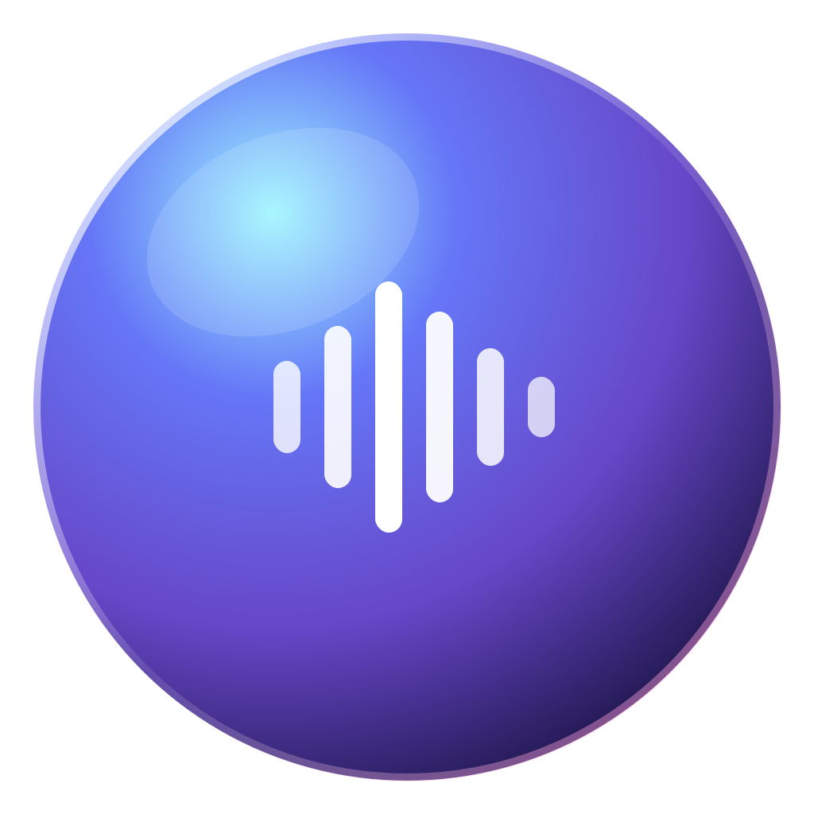
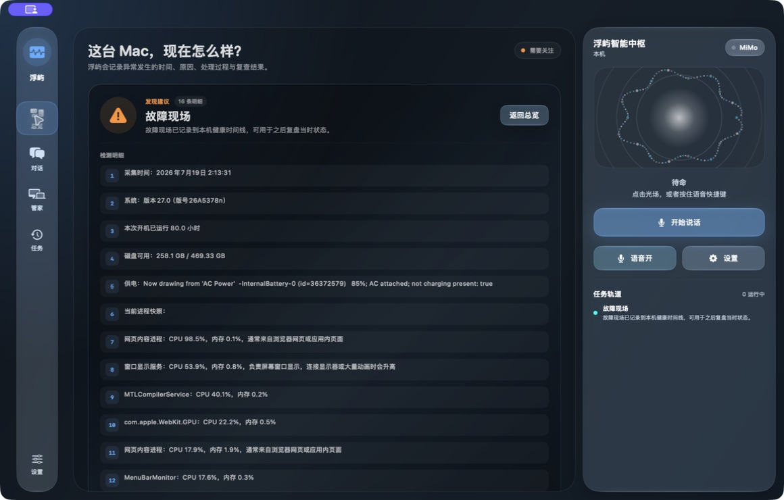
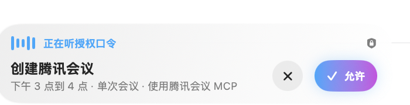
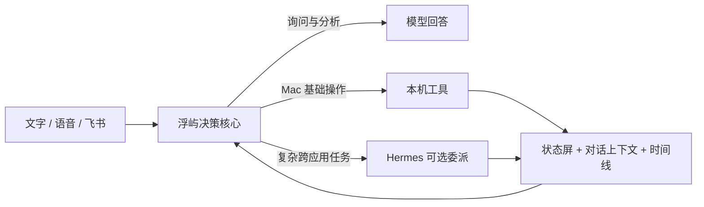
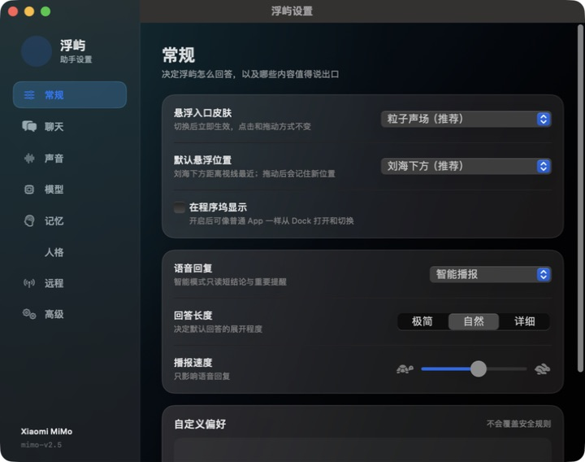

<div align="center">
  
  <h1>浮屿 FuYu</h1>
  <p><strong>会对话，也真正会照看 Mac。</strong></p>
  <p>原生语音助手、本机电脑管家与可控 Agent，统一在一个有反馈、有记忆、有安全边界的 macOS 工作台里。</p>

  <p>
    
    
    
    
    
  </p>

  <p>
    <a href="https://github.com/huochao123/FuYu/releases"><strong>下载最新版</strong></a>
    · <a href="#浮屿能做什么">功能</a>
    · <a href="#它如何工作">架构</a>
    · <a href="#安装与权限">安装</a>
    · <a href="CHANGELOG.md">更新日志</a>
    · <a href="#english">English</a>
  </p>
</div>



## 一个助手，一套完整的 Mac 交互

浮屿不是给另一个 Agent 套一层聊天窗口，也不是只会展示数字的“电脑管家”。它把对话、真实系统检测、本机执行、后台任务和后续追问连接成同一条工作流。

你可以先在电脑管家里检查启动项，再到对话中问“哪个最影响开机”；也可以直接说“检查最近为什么发热”，让浮屿先调用本机工具取得证据，再由模型解释影响和处理方式。简单操作不必绕行 Hermes，复杂跨应用任务才按需委派。

| 你做的事 | 浮屿给出的体验 |
| --- | --- |
| 说一句稍长的要求 | 悬浮语音条显示收音、临时文字、校正结果和最终采用文字，再送交 AI |
| 检查 Mac 状态 | 状态屏展示数量、证据、影响、风险和建议，不必去聊天记录找结果 |
| 继续追问“为什么” | AI 读取刚才的真实检测和时间，不重复扫描，也不把每句话当新会话 |
| 确认清理或整理 | 先预览，再说明收益和风险，明确确认后执行；可撤回的操作保留恢复入口 |
| 后台任务很慢 | 任务进入独立轨道，显示耗时与状态；你仍可继续文字或语音对话 |
| 电脑出现异常 | 低频本机监控只在真实异常时提示，并说明影响、危险程度和谁能处理 |

## 浮屿能做什么

### 语音：从“对讲机”变成连续对话

- 支持 Apple 本地识别、自动识别与 MiMo 混合校正。
- 长按 Fn / 地球键约 0.3 秒开始说话，轻触不会误启动收音。
- 连续会话不会因为静默、普通错误、后台任务或临时卡片自动结束；只有手动停止或明确说“结束对话”“关闭对话”“语音取消”才退出。
- 每一轮都显示“等待声音 → 实时识别 → 正在校正 → 最终文字”，长句也会等待完整识别。
- 支持打断播报、双击悬浮入口取消误识别，以及下一轮自动恢复收音。
- 语音回复经过独立筛选：朗读结论、关键影响和下一步；参数、路径、ID 与长数字留在屏幕上。
- 文字、语音、通知三条交互链严格分开：打字不会启动麦克风或悬浮语音窗。

<p align="center">
  
  
</p>

### 电脑管家：十三项真实本机能力

这些基础能力直接运行在 Mac 上，不消耗模型额度，也不需要 Hermes：

| 状态与诊断 | 存储与整理 | 应用与系统 |
| --- | --- | --- |
| 系统体检 | 垃圾清理预览 | 启动项检查 |
| 电池、供电与发热诊断 | 下载文件夹整理预览 | 应用残留扫描 |
| 持续高负载进程判断 | 大文件扫描 | 应用健康档案 |
| 性能与存储优化建议 | 重复文件哈希确认 | 浮屿权限核对 |
| 带准确时间的故障现场 |  |  |

检测不是终点。每份报告都包含：

- 检测时间与来源；
- 真实证据与抽样范围；
- 会造成什么影响、风险有多高；
- 浮屿能否处理，还是需要用户决定；
- “确认执行 / 暂不处理”的下一步入口。

所有文件修改遵循 **先扫描 → 看预览 → 明确确认 → 执行 → 验证结果**。删除默认移到废纸篓；智能整理记录实际移动位置并支持安全撤回。

### Agent：本机优先，复杂任务再委派

浮屿的决策核心明确区分三类结果：



- 系统状态、扫描、音量和常见应用启动优先走本机快速通道。
- 原因、影响、风险与方案分析交给当前模型，并附带本机证据。
- 跨应用复杂执行才选择 Hermes；没有 Hermes 时，聊天、语音、记忆和电脑管家仍然可用。
- 模型不能凭空宣称操作成功，必须收到真实工具结果。
- 只读检测可以并行；修改任务安全排队，并可在任务中心单独查看或取消。

### 记忆、时间与 Mac 专业知识

- 最近对话、当前任务、相关历史、永久习惯和完整会话归档分层保存。
- “继续”“去吧”“为什么”“昨天那个任务”等短句会关联真实任务与准确时间。
- 后台任务记录开始时间、最后进度和已等待时长，长时间无进展会如实标记“可能卡住”。
- 二十六个 Mac 专项 Skill 以索引方式存在，每次只加载与当前问题有关的一份正文，减少上下文和等待。
- 本机经验只学习真实执行结果，并绑定 macOS 版本；系统升级后旧经验必须重新验证。
- 支持自定义人格与“绾宁 · 古来客”，人格同时影响文字和语音表达，但不改变事实、工具权限或安全边界。

### 飞书远程入口

通过飞书企业自建应用和 WebSocket 长连接，可以在外面直接与浮屿沟通，无需额外部署公网服务器。普通问答直接返回飞书；清理、移动文件和系统修改仍在 Mac 上等待明确确认。

## 为状态而设计的界面

浮屿采用窄导航、中央状态工作区和右侧智能中枢三栏布局。总览是一块真正的“屏幕”，而不是六个放大的按钮：它持续呈现 Mac 状态、浮屿判断、后台任务、最近异常和处理进度。

- 三套主界面主题：深海蓝青、暖金石墨、冰川银蓝。
- 主界面、设置、语音条、授权卡和执行卡共享同一套 Liquid Glass 视觉语言。
- 卡片支持整块点击、悬停、按下、执行、成功与失败反馈。
- 长结果在状态屏内部滚动，不会滚动后只剩半块屏幕。
- 六款悬浮入口皮肤可即时切换。



| 粒子声场 | 极光流体 | 经典圆球 |
| --- | --- | --- |
|  |  |  |

## 安装与权限

### 系统要求

- macOS 15 或更高版本
- Apple Silicon Mac
- 使用云端模型、MiMo ASR 或云端语音时，需要对应服务的 API 密钥
- Hermes 仅在需要复杂跨应用控制时安装

### 安装

1. 从 [Releases](https://github.com/huochao123/FuYu/releases) 下载最新版 DMG。
2. 将“浮屿”拖入“应用程序”。
3. 首次启动后，在设置里选择模型、识别方式和声音。
4. 只在使用相应能力时授予所需权限。

当前公开构建使用临时签名。面向大范围分发前，仍建议使用 Apple Developer ID 签名并完成公证。

### 权限什么时候出现

| 权限 | 用途 | 触发时机 |
| --- | --- | --- |
| 麦克风 | 录制用户语音 | 第一次主动开始语音时 |
| 语音识别 | 实时临时字幕与本地回退 | MiMo 混合模式第一次主动语音时可请求；拒绝后 MiMo 最终识别仍可工作 |
| 辅助功能 | 跨应用控制 | 第一次使用对应执行能力时 |

纯文字聊天不会请求麦克风或语音识别权限。

## 隐私与安全边界

- 不包含广告或遥测，不保存原始录音。
- 电脑管家扫描、任务时间线和记忆文件默认保存在本机。
- 使用云端模型时，只有回答当前请求所选中的上下文会发送给用户选择的服务商。
- API 密钥保存在 macOS 钥匙串，不写入源码仓库。
- 发热监控和自主维护采用低频只读检查，不会擅自结束进程、清理或移动文件。
- 高风险或有数据影响的操作始终需要明确确认；人格和学习系统不能绕过这条边界。

详见 [隐私说明](PRIVACY.md) 与 [安全说明](SECURITY.md)。

## Siri 唤醒

在“快捷指令”中新建“开始说话”，添加“打开 URL”，填入：

```text
fuyu://listen
```

之后说“嘿 Siri，开始说话”即可唤醒浮屿。

## 从源码构建

```sh
DEVELOPER_DIR=/Library/Developer/CommandLineTools swift build
.build/debug/MiMoMac --self-test
scripts/package-app.sh
scripts/create-installer.sh
```

发布前的语音回归还可以运行：

```sh
.build/debug/MiMoMac --voice-cycle-smoke-test
.build/debug/MiMoMac --voice-dispatch-smoke-test
.build/debug/MiMoMac --mimo-asr-smoke-test
```

## 开源组件与参考

- 清理扫描、安全路径校验、移到废纸篓和日志能力集成自 [Dusty CleanerEngine](https://github.com/yagcioglutoprak/dusty)（MIT）。
- 实时状态与低频采样的产品设计参考 [Stats](https://github.com/exelban/stats)，浮屿使用自己的采样和持续高负载判断。
- [Mole](https://github.com/tw93/mole) 仅作为产品与安全边界参考，没有合并其 GPLv3 代码。

第三方许可见 [THIRD_PARTY_NOTICES.md](THIRD_PARTY_NOTICES.md)。欢迎提交 [Issue](https://github.com/huochao123/FuYu/issues)；参与开发前请阅读 [CONTRIBUTING.md](CONTRIBUTING.md)。

---

## English

**FuYu is a native voice assistant, local Mac care console, and controllable Agent for Apple Silicon.** It connects conversation, real system evidence, local execution, background tasks, and follow-up reasoning in one macOS interface.

### Highlights

- Continuous voice interaction with visible partial/final transcripts, interruption, explicit hang-up, and long-speech MiMo correction.
- Thirteen native Mac care tools for health, storage, files, apps, battery, permissions, thermal processes, and incident snapshots.
- Local-first routing for simple Mac actions; optional Hermes delegation only for complex cross-app work.
- Shared context between Mac Care results and chat, with timestamps, task state, relevant history, and on-demand Mac Skills.
- Safe preview, explicit approval, result verification, and undo support where available.
- A unified Liquid Glass interface across the dashboard, settings, voice overlay, approvals, and execution cards.
- Feishu WebSocket access, multiple model providers, custom personas, and SillyTavern character imports.
- No ads or telemetry. Local tools remain available when Hermes is not installed.

Requires macOS 15+ on Apple Silicon. Download the latest build from [Releases](https://github.com/huochao123/FuYu/releases). See [INSTALL.md](INSTALL.md), [PRIVACY.md](PRIVACY.md), [SECURITY.md](SECURITY.md), [CHANGELOG.md](CHANGELOG.md), and [ROADMAP.md](ROADMAP.md).

---

FuYu is an independent open-source project and is not affiliated with Apple or any listed model provider. Released under the [MIT License](LICENSE).
